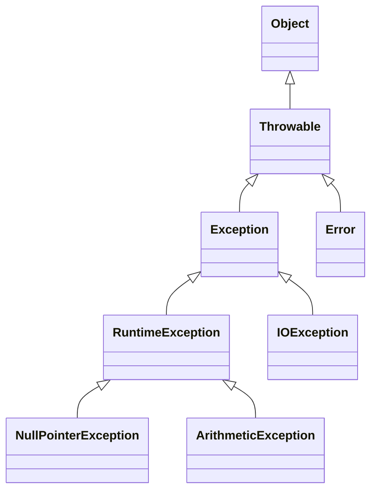
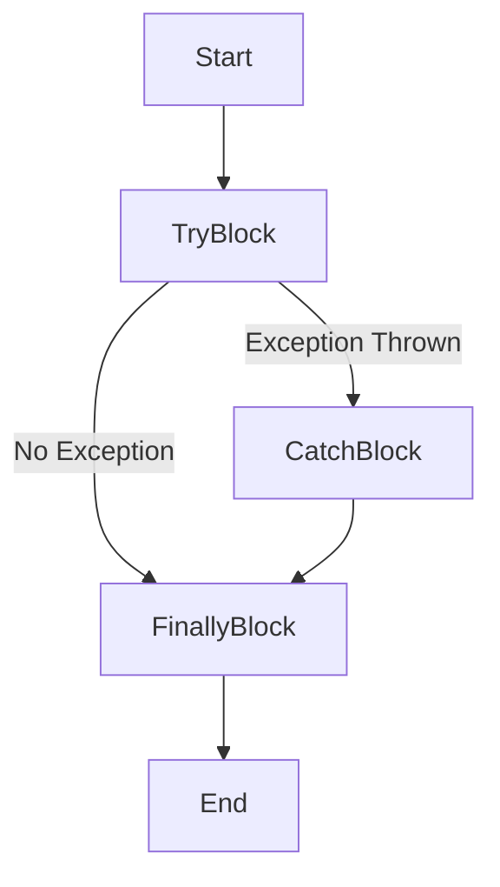

---

## 1. Introduction

### 1.1 What is an Exception?

An **exception** in Java is an event that disrupts the normal flow of a program's execution. When an error occurs within a method, the method creates an exception object and hands it off to the runtime system. This process is called **throwing an exception**.

Java's exception handling mechanism provides a way to transfer control from one part of a program to another, enabling programs to deal with unexpected situations gracefully.

### 1.2 Common Exceptions

Here are some common exceptions you might encounter:

- **`NullPointerException`**: Occurs when you try to use an object reference that has the `null` value.
- **`ArrayIndexOutOfBoundsException`**: Thrown when attempting to access an array with an invalid index.
- **`ArithmeticException`**: Happens when an illegal arithmetic operation is performed, like dividing by zero.
- **`IOException`**: Signals that an I/O operation has failed or been interrupted.

**Example of `NullPointerException`:**

```java
public class NullPointerExample {
    public static void main(String[] args) {
        String text = null;
        System.out.println(text.length()); // Throws NullPointerException
    }
}
```

<details>
<summary>Output</summary>

```
Exception in thread "main" java.lang.NullPointerException
    at NullPointerExample.main(NullPointerExample.java:4)
```

</details>

### 1.3 Checked and Unchecked Exceptions

Java exceptions are categorized into two main types:

- **Checked Exceptions**: Checked at compile-time. These exceptions must be either caught or declared in the method using the `throws` keyword.

    **Examples**: `IOException`, `SQLException`.

- **Unchecked Exceptions**: Not checked at compile-time. They are subclasses of `RuntimeException`.

    **Examples**: `NullPointerException`, `ArithmeticException`.

**Exception Hierarchy Diagram:**



### 1.4 try-catch Blocks

The `try-catch` block allows you to handle exceptions gracefully.

**Syntax:**

```java
try {
    // Code that may throw an exception
} catch (ExceptionType1 e1) {
    // Handle exception of type ExceptionType1
} catch (ExceptionType2 e2) {
    // Handle exception of type ExceptionType2
}
```

**Example:**

```java
public class TryCatchExample {
    public static void main(String[] args) {
        try {
            int division = 10 / 0; // May throw ArithmeticException
        } catch (ArithmeticException e) {
            System.out.println("Cannot divide by zero!");
        }
    }
}
```

<details>
<summary>Output</summary>

```
Cannot divide by zero!
```

</details>

#### DIY Exercise 1: Handling an ArrayIndexOutOfBoundsException

- **Task**: Suppose you have an array representing temperatures for each day of the week. Write a program that prompts the user to enter a day number (1-7) and prints the temperature for that day. Handle the case where the user enters an invalid day number using a `try-catch` block.

- **Hint**: Use an array of size 7 and handle `ArrayIndexOutOfBoundsException` when the user enters a day number outside the range.

### 1.5 finally Block

The `finally` block executes code regardless of whether an exception is thrown or caught.

**Syntax:**

```java
try {
    // Code that may throw an exception
} catch (ExceptionType e) {
    // Handle exception
} finally {
    // Code that will always execute
}
```

**Example:**

```java
public class FinallyExample {
    public static void main(String[] args) {
        try {
            int[] numbers = {1, 2, 3};
            System.out.println(numbers[5]); // May throw ArrayIndexOutOfBoundsException
        } catch (ArrayIndexOutOfBoundsException e) {
            System.out.println("Index out of bounds!");
        } finally {
            System.out.println("This will always execute.");
        }
    }
}
```

<details>
<summary>Output</summary>

```
Index out of bounds!
This will always execute.
```

</details>

**Flow Diagram of try-catch-finally:**



#### DIY Exercise 2: Using finally Block

- **Task**: Create a simple calculator program that performs division. Prompt the user to enter two numbers and divide them. Use a `try-catch` block to handle any `ArithmeticException` (e.g., division by zero). Use a `finally` block to print "Calculation completed."

- **Hint**: Place the division operation inside a `try` block, handle `ArithmeticException` in the `catch` block, and in the `finally` block, print the completion message.

### 1.6 try-with-resources

The `try-with-resources` statement ensures that each resource is closed at the end of the statement. A resource must implement the `AutoCloseable` interface.

Since you haven't covered Java I/O yet, we'll use a custom resource to demonstrate `try-with-resources`.

**Syntax:**

```java
try (ResourceType resource = new ResourceType()) {
    // Use the resource
} catch (ExceptionType e) {
    // Handle exception
}
```

**Example with a Custom Resource:**

```java
public class TryWithResourcesExample {
    public static void main(String[] args) {
        try (MyResource resource = new MyResource()) {
            resource.doSomething();
        } catch (Exception e) {
            System.out.println("Exception occurred: " + e.getMessage());
        }
    }
}

class MyResource implements AutoCloseable {
    public MyResource() {
        System.out.println("Resource opened.");
    }

    public void doSomething() throws Exception {
        System.out.println("Resource is being used.");
        // Simulate an exception
        throw new Exception("An error occurred while using the resource.");
    }

    @Override
    public void close() {
        System.out.println("Resource closed.");
    }
}
```

<details>
<summary>Output</summary>

```
Resource opened.
Resource is being used.
Resource closed.
Exception occurred: An error occurred while using the resource.
```

</details>

In this example:

- `MyResource` is a custom class that implements `AutoCloseable`.
- The `close()` method is automatically called at the end of the `try` block, even if an exception occurs.
- This demonstrates resource management without using Java I/O.

#### DIY Exercise 3: Implementing try-with-resources with a Custom Resource

- **Task**: Create a class `SimpleTimer` that implements `AutoCloseable`. In its constructor, record the start time. In the `close()` method, calculate and print the elapsed time. Use `try-with-resources` to measure the execution time of a block of code.

- **Hint**: Use `System.currentTimeMillis()` to get the current time in milliseconds.

### 1.7 throw and throws Keywords

- **`throw`**: Used to explicitly throw an exception from a method or any block of code.
- **`throws`**: Used in method signatures to declare that a method might throw exceptions.

**Using `throw`:**

```java
public class ThrowExample {
    public static void main(String[] args) {
        try {
            validateAge(15); // This will throw an exception
        } catch (IllegalArgumentException e) {
            System.out.println(e.getMessage());
        }
    }

    public static void validateAge(int age) {
        if (age < 18) {
            throw new IllegalArgumentException("Age must be at least 18.");
        }
        System.out.println("Age is valid.");
    }
}
```

<details>
<summary>Output</summary>

```
Age must be at least 18.
```

</details>

#### DIY Exercise 4: Throwing Exceptions

- **Task**: In a grading system, create a method `calculateGrade` that takes a student's score as input. If the score is negative or greater than 100, throw an `IllegalArgumentException` with the message "Invalid score". Handle the exception in the main method and display the error message to the user.

- **Hint**: Use the `throw` keyword to throw the exception, and use a `try-catch` block in `main` to handle it.

**Using `throws`:**

```java
public class ThrowsExample {
    public static void main(String[] args) {
        try {
            performOperation(); // May throw Exception
        } catch (Exception e) {
            System.out.println("Exception handled: " + e.getMessage());
        }
    }

    public static void performOperation() throws Exception {
        throw new Exception("An error occurred.");
    }
}
```

<details>
<summary>Output</summary>

```
Exception handled: An error occurred.
```

</details>

#### DIY Exercise 5: Declaring Exceptions with throws

- **Task**: Write a method `processData` that declares it throws an `Exception`. In your `main` method, call `processData` and handle the exception, displaying an appropriate message to the user.

- **Hint**: Use `throws` in the method signature and handle `Exception` when calling the method.

### 1.8 Custom Exceptions

Sometimes, the standard exceptions provided by Java are not sufficient for representing specific error conditions in your application. In such cases, you can create your own custom exceptions by extending the `Exception` class or one of its subclasses.

**Example of a Custom Exception:**

```java
public class InvalidAgeException extends Exception {
    public InvalidAgeException(String message) {
        super(message);
    }
}
```

**Using the Custom Exception:**

```java
public class CustomExceptionExample {
    public static void main(String[] args) {
        try {
            registerUser(15); // This will throw an exception
        } catch (InvalidAgeException e) {
            System.out.println(e.getMessage());
        }
    }

    public static void registerUser(int age) throws InvalidAgeException {
        if (age < 18) {
            throw new InvalidAgeException("User must be at least 18 years old.");
        }
        System.out.println("User registered successfully.");
    }
}
```

<details>
<summary>Output</summary>

```
User must be at least 18 years old.
```

</details>

#### DIY Exercise 6: Creating a Custom Exception

- **Task**: Create a custom exception class named `InsufficientFundsException` that extends `Exception`. Write a `BankAccount` class with a `withdraw` method that throws `InsufficientFundsException` if the withdrawal amount is greater than the account balance.

- **Hint**: Implement the `withdraw` method to check the balance and throw the custom exception with an appropriate message.

---

## 2. Summary

In this lab, you've learned about Java's exception handling mechanisms:

- **Exceptions** are events that disrupt normal program flow.
- **Common Exceptions** include `NullPointerException`, `ArrayIndexOutOfBoundsException`, and `ArithmeticException`.
- **Checked Exceptions** must be handled or declared, whereas **Unchecked Exceptions** do not require explicit handling.
- **try-catch Blocks** allow you to handle exceptions gracefully.
- The **finally Block** executes code regardless of exceptions.
- **try-with-resources** ensures that resources are closed automatically.
- The **throw** keyword lets you throw an exception manually.
- The **throws** keyword indicates that a method might throw exceptions.
- **Custom Exceptions** allow you to define application-specific error conditions.

Understanding these concepts is crucial for writing robust and error-resistant Java applications.

---

### Additional Notes

- **Custom Exceptions**: By adding the custom exceptions section, you can now create exceptions that are specific to your application's domain, improving error handling and code readability.

- **Simplified try-with-resources Example**: The updated `try-with-resources` section uses a custom class to demonstrate how resources can be managed without relying on Java I/O. This makes the concept accessible even without prior knowledge of I/O operations.

---
