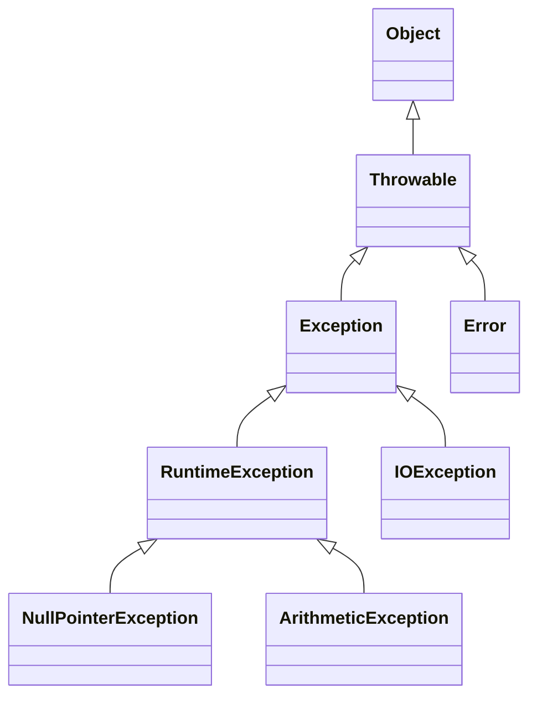
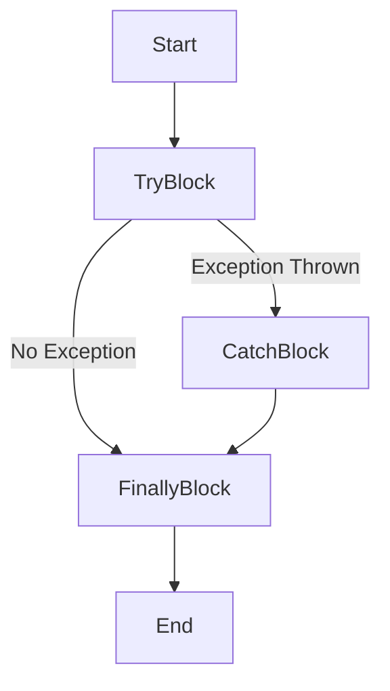

## 1. Introduction

### 1.1 What is an Exception?

An **exception** in Java is an event that disrupts the normal flow of a program's execution. When an error occurs within a method, the method creates an exception object and hands it off to the runtime system. This process is called **throwing an exception**.

Java's exception handling mechanism provides a way to transfer control from one part of a program to another, enabling programs to deal with unexpected situations gracefully.

### 1.2 Common Exceptions

Here are some common exceptions you might encounter:

- **`NullPointerException`**: Occurs when you try to use an object reference that has the `null` value.
- **`ArrayIndexOutOfBoundsException`**: Thrown when attempting to access an array with an invalid index.
- **`ArithmeticException`**: Happens when an illegal arithmetic operation is performed, like dividing by zero.
- **`IOException`**: Signals that an I/O operation has failed or been interrupted.

**Example of `NullPointerException`:**

```java
public class NullPointerExample {
    public static void main(String[] args) {
        String text = null;
        System.out.println(text.length()); // Throws NullPointerException
    }
}
```

<details>
<summary>Output</summary>

```
Exception in thread "main" java.lang.NullPointerException
    at NullPointerExample.main(NullPointerExample.java:4)
```

</details>

### 1.3 Checked and Unchecked Exceptions

Java exceptions are categorized into two main types:

- **Checked Exceptions**: Checked at compile-time. These exceptions must be either caught or declared in the method using the `throws` keyword.

    **Examples**: `IOException`, `SQLException`.

- **Unchecked Exceptions**: Not checked at compile-time. They are subclasses of `RuntimeException`.

    **Examples**: `NullPointerException`, `ArithmeticException`.

**Exception Hierarchy Diagram:**



### 1.4 try-catch Blocks

The `try-catch` block allows you to handle exceptions gracefully.

**Syntax:**

```java
try {
    // Code that may throw an exception
} catch (ExceptionType1 e1) {
    // Handle exception of type ExceptionType1
} catch (ExceptionType2 e2) {
    // Handle exception of type ExceptionType2
}
```

**Example:**

```java
public class TryCatchExample {
    public static void main(String[] args) {
        try {
            int division = 10 / 0; // May throw ArithmeticException
        } catch (ArithmeticException e) {
            System.out.println("Cannot divide by zero!");
        }
    }
}
```

<details>
<summary>Output</summary>

```
Cannot divide by zero!
```

</details>

#### DIY Exercise 1: Handling an ArrayIndexOutOfBoundsException

- **Task**: Write a program that attempts to access an array index that doesn't exist and handle the exception.
- **Hint**: Create an array of size 3 and try to access the 5th element using a `try-catch` block.

### 1.5 finally Block

The `finally` block executes code regardless of whether an exception is thrown or caught.

**Syntax:**

```java
try {
    // Code that may throw an exception
} catch (ExceptionType e) {
    // Handle exception
} finally {
    // Code that will always execute
}
```

**Example:**

```java
public class FinallyExample {
    public static void main(String[] args) {
        try {
            int[] numbers = {1, 2, 3};
            System.out.println(numbers[5]); // May throw ArrayIndexOutOfBoundsException
        } catch (ArrayIndexOutOfBoundsException e) {
            System.out.println("Index out of bounds!");
        } finally {
            System.out.println("This will always execute.");
        }
    }
}
```

<details>
<summary>Output</summary>

```
Index out of bounds!
This will always execute.
```

</details>

**Flow Diagram of try-catch-finally:**



#### DIY Exercise 2: Using finally Block

- **Task**: Write a program that performs division and uses a `finally` block to print "Operation completed."
- **Hint**: Include the division inside a `try` block, handle `ArithmeticException`, and add a `finally` block that prints the message.

### 1.6 try-with-resources

The `try-with-resources` statement ensures that each resource is closed at the end of the statement. A resource must implement the `AutoCloseable` interface.

**Syntax:**

```java
try (ResourceType resource = new ResourceType()) {
    // Use the resource
} catch (ExceptionType e) {
    // Handle exception
}
```

**Example:**

```java
import java.io.BufferedReader;
import java.io.FileReader;
import java.io.IOException;

public class TryWithResourcesExample {
    public static void main(String[] args) {
        try (BufferedReader br = new BufferedReader(new FileReader("example.txt"))) {
            String line = br.readLine();
            System.out.println(line);
        } catch (IOException e) {
            System.out.println("IOException occurred!");
        }
    }
}
```

<details>
<summary>Output (Assuming "example.txt" is missing)</summary>

```
IOException occurred!
```

</details>

#### DIY Exercise 3: Implementing try-with-resources

- **Task**: Write a program that reads from a file using `try-with-resources` to ensure the file is closed properly.
- **Hint**: Use `BufferedReader` and handle `IOException`.

### 1.7 throw and throws Keywords

- **`throw`**: Used to explicitly throw an exception from a method or any block of code.
- **`throws`**: Used in method signatures to declare that a method might throw exceptions.

**Using `throw`:**

```java
public class ThrowExample {
    public static void main(String[] args) {
        validateAge(15); // This will throw an exception
    }

    public static void validateAge(int age) {
        if (age < 18) {
            throw new IllegalArgumentException("Age must be at least 18.");
        }
        System.out.println("Age is valid.");
    }
}
```

<details>
<summary>Output</summary>

```
Exception in thread "main" java.lang.IllegalArgumentException: Age must be at least 18.
    at ThrowExample.validateAge(ThrowExample.java:6)
    at ThrowExample.main(ThrowExample.java:3)
```

</details>

#### DIY Exercise 4: Throwing Exceptions

- **Task**: Create a method `checkScore` that throws an `IllegalArgumentException` if the score is negative.
- **Hint**: Use the `throw` keyword and handle the exception in `main`.

**Using `throws`:**

```java
import java.io.IOException;

public class ThrowsExample {
    public static void main(String[] args) {
        try {
            readFile(); // May throw IOException
        } catch (IOException e) {
            System.out.println("IOException handled!");
        }
    }

    public static void readFile() throws IOException {
        throw new IOException("File not found.");
    }
}
```

<details>
<summary>Output</summary>

```
IOException handled!
```

</details>

#### DIY Exercise 5: Declaring Exceptions with throws

- **Task**: Write a method `connectToDatabase` that declares it throws a `SQLException`.
- **Hint**: Use `throws` in the method signature and handle the exception when calling the method.

---

## 2. Summary

In this lab, you've learned about Java's exception handling mechanisms:

- **Exceptions** are events that disrupt normal program flow.
- **Common Exceptions** include `NullPointerException`, `ArrayIndexOutOfBoundsException`, and `ArithmeticException`.
- **Checked Exceptions** must be handled or declared, whereas **Unchecked Exceptions** do not require explicit handling.
- **try-catch Blocks** allow you to handle exceptions gracefully.
- The **finally Block** executes code regardless of exceptions.
- **try-with-resources** ensures that resources are closed automatically.
- The **throw** keyword lets you throw an exception manually.
- The **throws** keyword indicates that a method might throw exceptions.

Understanding these concepts is crucial for writing robust and error-resistant Java applications.
